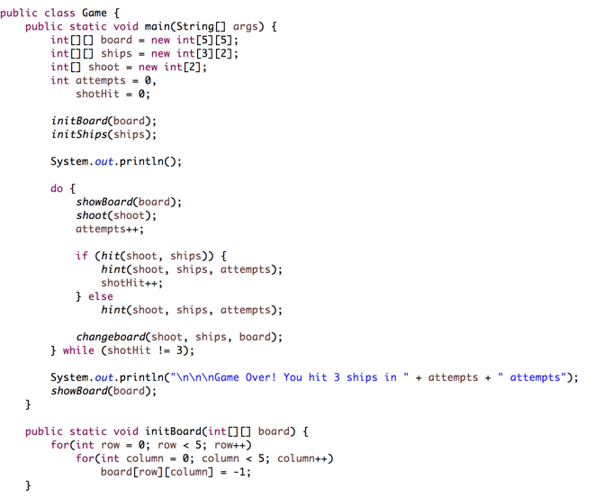

# Battleship [Java]

## About

Battleship (also Battleships or Sea Battle) is a guessing game for two players. It is known worldwide as a pencil and paper game which dates from World War I. It was published by various companies as a pad-and-pencil game in the 1930s, and was released as a plastic board game by Milton Bradley in 1967.

## Install

In order to start playing this game, you will need to clone/download it to your machine.
